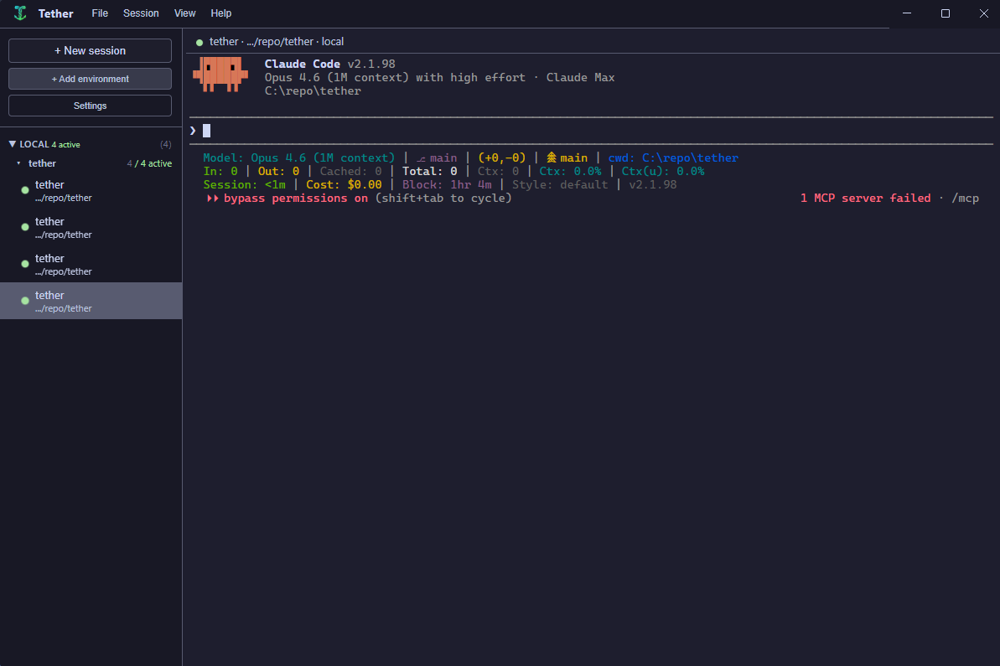

<p align="center">
  
</p>

<h1 align="center">Tether</h1>

<p align="center">
  A desktop session multiplexer for <a href="https://docs.anthropic.com/en/docs/claude-code">Claude Code</a>.<br/>
  Manage multiple sessions across local, SSH, and container environments — with the full native terminal experience.
</p>

<p align="center">
  <a href="LICENSE"></a>
  
  
</p>

<p align="center">
  
</p>

---

## Why?

Claude Code is great, but managing multiple sessions across environments is painful:

- Sessions scattered across terminals, tmux panes, SSH connections, and container shells
- Context switching means remembering which tab has which repo on which machine
- SSH disconnects kill sessions; laptop sleep interrupts work
- Tools that parse and re-render Claude Code output break the native experience

Tether gives you a **single window** with a sidebar to manage it all — while every session stays a real PTY piped byte-for-byte into xterm.js. Claude Code doesn't know it's being managed.

## Features

- **Multiple concurrent sessions** with instant switching
- **Local and SSH environments** — node-pty locally, ssh2 for remote
- **Status indicators** — green (running), amber (waiting), gray (idle), red (dead)
- **Session grouping** — auto-grouped by working directory, collapsible
- **Environment management** — preconfigured environments with per-env settings
- **Env var cascade** — app defaults &rarr; environment &rarr; session overrides, with presets for common Claude Code vars
- **CLI flag management** — app-wide and per-session (`--dangerously-skip-permissions`, `--verbose`, etc.)
- **Workspace persistence** — sessions save on quit, restore on launch
- **Catppuccin themes** — Mocha, Macchiato, Frappe, Latte, plus Default Dark
- **Keyboard shortcuts** — `Ctrl+N` new, `Ctrl+1-9` switch, `Ctrl+B` toggle sidebar, `Ctrl+W` stop

## Core Principle

> **Dumb pipe, smart shell.** Never parse, intercept, or re-render Claude Code output. The PTY stream flows untouched into xterm.js. Status detection is a passive side-channel tap, not an interceptor.

## Quick Start

```bash
npm install       # install dependencies
npm run start     # launch in dev mode (Electron Forge + Vite)
```

## Tech Stack

| | Technology | Why |
|---|---|---|
| Shell | Electron 41 | Cross-platform, native window management, IPC |
| Frontend | React 19 + TypeScript | Component model, ecosystem |
| Terminal | xterm.js 6.0 | Full VT emulation — same engine as VS Code |
| Local PTY | node-pty | Real pseudo-terminal, same lib as VS Code |
| SSH | ssh2 | Pure JS SSH client with PTY channel support |
| State | JSON file persistence | Embedded, zero-config |
| Build | Electron Forge + Vite | Fast dev server, optimized production builds |

## Documentation

| | |
|---|---|
| [Architecture](ARCHITECTURE.md) | System design, component diagram, IPC, data schema |
| [Transport Design](TRANSPORT_DESIGN.md) | Transport interface, Local/SSH adapter specs, data flow |
| [UI Design](UI_DESIGN.md) | Layout, sidebar, terminal panel, interaction model |
| [Product Spec](PRODUCT_SPEC.md) | Vision, user stories, feature requirements |
| [MVP Scope](MVP_SCOPE.md) | Milestones and post-MVP roadmap |
| [Changelog](CHANGELOG.md) | Release history |

## License

[MIT](LICENSE)
